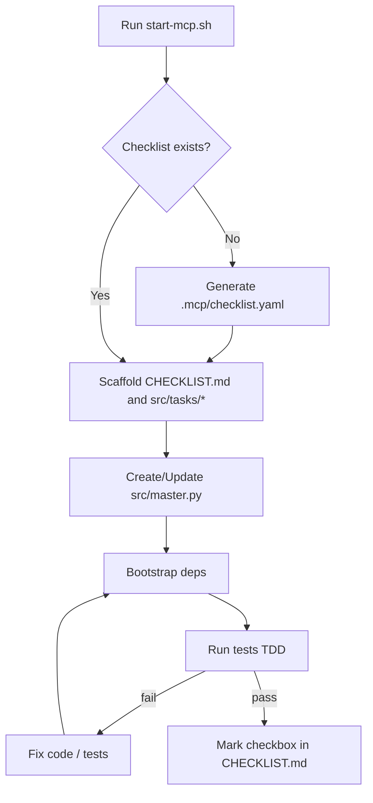

# test-Driven_Development-MCP

> **🎯 Local Development Focus**: TDD-MCP runs locally via Docker with your repository mounted. Simple, fast, and no remote deployment complexity.

Local TDD-focused MCP server that discovers or generates repo checklists and kicks off bootstrap/tests.

## Workflow Diagram



## Table of Contents
- [Overview](#overview)
- [Quick Start (Local Docker)](#quick-start-local-docker)
- [Language Selection](#language-selection)
- [Endpoints](#endpoints)
- [Using TDD-MCP in Other Repositories](#using-tdd-mcp-in-other-repositories)
- [Modular Functions and Master Orchestration](#modular-functions-and-master-orchestration)
- [Optional: CLI Checklist Tool](#optional-cli-checklist-tool)
- [See also: GETTING_STARTED.md](#see-also-getting_startedmd)

## Overview
This server can:
- Detect `.mcp/*.yaml` checklists in a repo, or generate one from `README.md` if missing
- Create CHECKLIST.md on the repo root with checkboxes for human understanding (see [Workflow.md](WorkFlow.md))
- Run dependency bootstrap and tests to support a TDD workflow
- Operate entirely locally with your repository mounted into the Docker container

**Key Design Decision:**
TDD-MCP runs locally via Docker to ensure the server has direct filesystem access to your repository. This eliminates the architectural complexity of remote deployments while maintaining isolation and reproducibility.

Acceptance criteria:
- A checklist exists under `.mcp/checklist.yaml` or is generated when missing
- Actions and generation can be dry-run before writing
- Server has read/write access to the repository filesystem

## Quick Start (Local Docker)

**Port:** `63777` (chosen to avoid common conflicts)  
**Container Name:** `TDD-MCP`  
**Access:** `http://localhost:63777`

### From This Repository

```bash
# Start server for this repository
LANGUAGE=python ./start-mcp.sh .
```

### From Any Other Repository

```bash
# Start TDD-MCP server with your project mounted
LANGUAGE=python /path/to/test-driven-development-mcp/start-mcp.sh $(pwd)
```

**What happens automatically:**
- 🐳 Builds and runs Docker container at `http://localhost:63777`
- 📁 Mounts your repository at `/work` inside container
- 🔍 Introduces the server to your repository structure
- 📋 Creates checklist or starts TDD bootstrap/tests
- ✅ Server has full read/write access to your files

## Language Selection
- The server accepts a default language and includes it in generated checklists as `metadata.default_language`
- Supported languages: `python`, `node`, `go`, `rust`, `java`, `cpp`
- The start script prompts for a language if `LANGUAGE` env var is not set

**Examples:**

```bash
# Interactive (will prompt for language)
./start-mcp.sh /path/to/repo

# Non-interactive with language specified
LANGUAGE=python ./start-mcp.sh /path/to/repo
LANGUAGE=node ./start-mcp.sh /path/to/repo
LANGUAGE=go ./start-mcp.sh /path/to/repo
```

## Endpoints
**Base URL:** `http://localhost:63777`

- `GET /health` - Check server health
- `GET /version` - Get server version
- `GET /docs` - Interactive API documentation (Swagger UI)
- `POST /introduce` - Introduce repository to server
  - Body: `{ "repoPath": "/work" }`
  - Returns: Repository info, existing checklists, next steps
- `POST /ensure-checklist` - Generate or verify checklist existence
  - Body: `{ "repoPath": "/work", "dryRun": false, "language": "python|node|go|rust|java|cpp" }`
  - Creates `.mcp/checklist.yaml` and `CHECKLIST.md`
- `POST /tdd/start` - Begin TDD workflow
  - Body: `{ "repoPath": "/work", "language": "python|node|go|rust|java|cpp" }`
  - Bootstraps dependencies and runs tests

**Example Usage:**

```bash
# Check health
curl http://localhost:63777/health

# Introduce your repository
curl -X POST http://localhost:63777/introduce \
  -H "Content-Type: application/json" \
  -d '{"repoPath": "/work"}'

# Generate checklist
curl -X POST http://localhost:63777/ensure-checklist \
  -H "Content-Type: application/json" \
  -d '{"repoPath": "/work", "language": "python", "dryRun": false}'

# Start TDD workflow
curl -X POST http://localhost:63777/tdd/start \
  -H "Content-Type: application/json" \
  -d '{"repoPath": "/work", "language": "python"}'
```

## Modular Functions and Master Orchestration

- Modular functions are written to individual files under `src/tasks/` (one file per checklist item).
- The master orchestration file `src/master.py` imports and calls each task function in order.
- Above each imported function is a comment pointing to the concrete file path, making RCAs and code navigation easy.
- This pattern is a standard and essential practice in this project to keep changes auditable and tasks independently testable.

### Checkbox semantics
- Each checklist item corresponds to a checkbox in `CHECKLIST.md`.
- An item is checked only when its tests pass and the function is wired into `src/master.py`.
- Unchecked items are either not implemented or failing tests.

## Optional: CLI Checklist Tool
You can also manage checklists via a small Node CLI (useful outside the server):

```bash
node bin/mcp-checklist.js --repo . --dry-run
node bin/mcp-checklist.js --repo .
```

Or with env var:

```bash
MCP_REPO_PATH=$(pwd) node bin/mcp-checklist.js --dry-run
```

When embedded in an MCP server, the CLI can be invoked at startup with the target repo path; if no checklist files are found, it will generate `.mcp/checklist.yaml` based on the README and exit successfully.

## Using TDD-MCP in Other Repositories

TDD-MCP is designed to work with any repository through local Docker. Here are the recommended approaches:

### Method 1: Use the Start Script (Recommended)

The simplest way to use TDD-MCP with any repository:

```bash
# Clone or download TDD-MCP repository once
git clone https://github.com/Hawaiideveloper/test-Driven_Development-MCP.git ~/tdd-mcp

# Use with any project
cd /path/to/your/project
LANGUAGE=python ~/tdd-mcp/start-mcp.sh $(pwd)
```

**What happens:**
- 🐳 Launches Docker container with your repository mounted
- 📁 Server has full read/write access to your files
- 🔍 Auto-detects or generates checklists
- ✅ Ready to start TDD workflow

### Method 2: Quick Repository Helper Script

For instant TDD setup in any new repository:

```bash
# One-liner: Download and run in any repository
curl -sSL https://raw.githubusercontent.com/Hawaiideveloper/test-Driven_Development-MCP/main/tdd-helper.sh -o tdd-helper.sh && chmod +x tdd-helper.sh && ./tdd-helper.sh
```

**What the helper script does:**
- 🔍 **Auto-detects** existing TDD-MCP Docker containers
- 📝 **Introduces** your repository to TDD-MCP
- 🎯 **Language Detection**: Auto-detects Python, Node.js, Go, Rust, Java, C++
- 📋 **Checklist Creation**: Generates `CHECKLIST.md` and `.mcp/checklist.yaml`
- ⚙️ **Configuration Save**: Creates `.tdd-mcp-config` for future use

**Supported Project Types:**
- **Python**: `requirements.txt`, `setup.py`, `pyproject.toml`
- **Node.js**: `package.json`
- **Go**: `go.mod`
- **Rust**: `Cargo.toml`
- **Java**: `pom.xml`, `build.gradle`
- **C++**: `CMakeLists.txt`, `Makefile`

### Method 3: Manual Docker Run

Run TDD-MCP directly with Docker:

```bash
# In your repository
docker run -d -p 63777:63777 \
  -v "$(pwd):/work" \
  --name TDD-MCP \
  ghcr.io/hawaiideveloper/tdd-mcp:latest

# Server is now available at http://localhost:63777
curl http://localhost:63777/health
```

### Method 4: Git Submodule Integration

Add TDD-MCP as a submodule for version control:

```bash
# In your repository
git submodule add https://github.com/Hawaiideveloper/test-Driven_Development-MCP.git .tdd-mcp
git submodule update --init --recursive

# Run from submodule
cd .tdd-mcp
./start-mcp.sh ..
```

### Method 5: Standalone Python Server

Run the server directly without Docker:

```bash
# Clone the repository
git clone https://github.com/Hawaiideveloper/test-Driven_Development-MCP.git
cd test-Driven_Development-MCP

# Install dependencies
pip install -r server/requirements.txt

# Run server
cd server
python main.py

# Server runs on http://localhost:63777
```

**Note:** This method requires Python 3.8+ and manual dependency management.

## See also: GETTING_STARTED.md
For a fuller walkthrough and editor-specific tips (VS Code, Cursor, Claude), see `GETTING_STARTED.md`.
