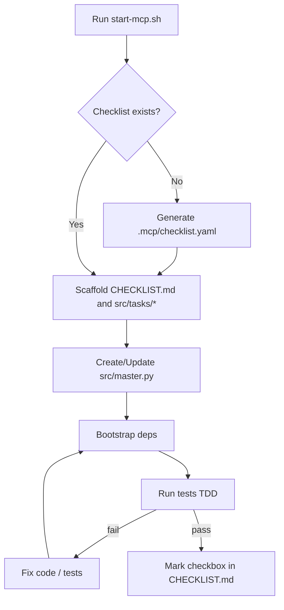

# test-Driven_Development-MCP

Local TDD-focused MCP server that discovers or generates repo checklists and kicks off bootstrap/tests.

## Workflow Diagram



## Table of Contents
- [Overview](#overview)
- [Quick Start (Docker)](#quick-start-docker)
- [Language Selection](#language-selection)
- [Endpoints](#endpoints)
- [Modular Functions and Master Orchestration](#modular-functions-and-master-orchestration)
- [Optional: CLI Checklist Tool](#optional-cli-checklist-tool)
- [See also: GETTING_STARTED.md](#see-also-getting_startedmd)

## Overview
This server can:
- Detect `.mcp/*.yaml` checklists in a repo, or generate one from `README.md` if missing
- Then create a CHECKLIST.md on the repo root and create items with checkboxes near them for human understanding.  see [Workflow.md](WorkFlow.md) for more information
- Run dependency bootstrap and tests to support a TDD workflow

Acceptance criteria:
- A checklist exists under `.mcp/checklist.yaml` or is generated when missing
- Actions and generation can be dry-run before writing

## Quick Start (Docker)

Port: `63777` (chosen to avoid common conflicts). Container name: `TDD-MCP`.

From the repo root:

```bash
LANGUAGE=python ./start-mcp.sh .
```

This will:
- Build and run the container at `http://localhost:63777`
- Mount your repo at `/work`
- Introduce the server, then either create a checklist or start the TDD bootstrap/tests

## Language Selection
- The server accepts a default language and includes it in generated checklists as `metadata.default_language` (e.g., `python`, `node`, `go`, `rust`, `java`, `cpp`).
- The start script prompts for a language if `LANGUAGE` env var is not set.
- Example non-interactive run:

```bash
LANGUAGE=python ./start-mcp.sh /path/to/repo
```

## Kubernetes Deployment

Deploy to Kubernetes using Helm:

```bash
# Deploy with private GHCR image
helm upgrade --install tdd-mcp ./helm/tdd-mcp \
  --namespace test-driven-development \
  --create-namespace \
  --set 'imagePullSecrets[0].name=ghcr-secret'
```

Access via NodePort (external access):
- NodePort: `30234` maps to internal port `63777`
- Base URL: `http://<NODE_IP>:30234`

## Endpoints
Base URL: `http://localhost:63777` (Docker) or `http://<NODE_IP>:30234` (Kubernetes)

- `GET /health`
- `POST /introduce`
  - Body: `{ "repoPath": "/work" }`
- `POST /ensure-checklist`
  - Body: `{ "repoPath": "/work", "dryRun": false, "language": "python|node|go|rust|java|cpp" }`
- `POST /tdd/start`
  - Body: `{ "repoPath": "/work", "language": "python|node|go|rust|java|cpp" }`

## Modular Functions and Master Orchestration

- Modular functions are written to individual files under `src/tasks/` (one file per checklist item).
- The master orchestration file `src/master.py` imports and calls each task function in order.
- Above each imported function is a comment pointing to the concrete file path, making RCAs and code navigation easy.
- This pattern is a standard and essential practice in this project to keep changes auditable and tasks independently testable.

### Checkbox semantics
- Each checklist item corresponds to a checkbox in `CHECKLIST.md`.
- An item is checked only when its tests pass and the function is wired into `src/master.py`.
- Unchecked items are either not implemented or failing tests.

## Optional: CLI Checklist Tool
You can also manage checklists via a small Node CLI (useful outside the server):

```bash
node bin/mcp-checklist.js --repo . --dry-run
node bin/mcp-checklist.js --repo .
```

Or with env var:

```bash
MCP_REPO_PATH=$(pwd) node bin/mcp-checklist.js --dry-run
```

When embedded in an MCP server, the CLI can be invoked at startup with the target repo path; if no checklist files are found, it will generate `.mcp/checklist.yaml` based on the README and exit successfully.

## See also: GETTING_STARTED.md
For a fuller walkthrough and editor-specific tips (VS Code, Cursor, Claude), see `GETTING_STARTED.md`.
